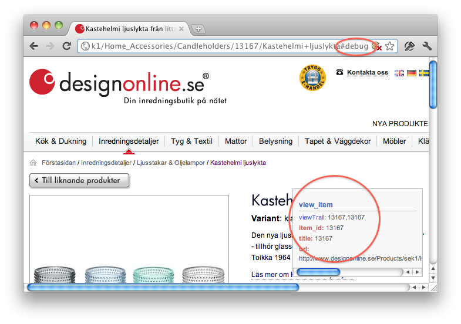

# Checklista för Webtraffic

## Lägg in observationsskriptet på produktsidorna i god tid

Releware räknar ut rekommendationer genom att observera vilka produkter besökarna tittar på.  För att det ska finnas ett tillräckligt underlag för beräkningarna måste observationsskriptet vara aktivt på produktsidorna i minst 4–7 dagar innan kampanjen börjar.

## Produkt-id i observationerna

Observationsskriptet registrerar ett produkt-id men inte mer.  För att kunna visa namn, pris, etc på produkterna behöver Releware kunna använda produkt-id:t för att slå upp information i den prisfil som butiken tillhandahåller (se nedan).  Produkt-id måste vara *beständigt*, dvs inte förändras under kampanjen och *unikt*, alltså bara användas för en produkt (inklusive varianter).

* **Använd inte produktnamn som produkt-id.**  Ibland är produktnamn felstavade, och när butiken rättar dem försvinner de ur rekommendationerna.
* **Produkt-id får inte innehålla kommatecken** och vi rekommenderar att de inte innehåller svenska tecken (åäö) eller specialtecken som <code>%, &amp;, '</code> eller <code>"</code> (enkla eller dubbla citationstecken).
* **Använd samma produkt-id för varianter.**  Om en produkt finns i flera varianter, t.ex. en tröja med ett visst tryck i storlek S-XL, är det viktigt för kvalitén på rekommendationerna att hitta ett gemensamt produkt-id för varianterna.

## Kontrollera att observationsskriptet lagts in

Gå till en produktsida i butiken.  Lägg till `#debug` sist i sidans URL, tryck retur och ladda sedan om sidan (&#8984;-R på mac, CTRL-R eller F5 annars).   Om skriptet fungerar visas nu en debugruta enligt bilden:

Det finns inget motsvarande sätt att kontrollera att konverteringsskriptet har lagts in.

## Prisfilen

Butiken måste tillhandahålla prisfil som innehåller (a)
samma produkt-id som används i observationsskriptet, (b) URL till bild som
fungerar med annonserna och (c) övrig produktdata enligt specifikationen på
[prisfilssidan](index.html).

Vanliga problem med prisfilen:

* **Otillräcklig omkodning:** XML-formatet kräver att tecknen `<, &` samt (i vissa fall) `"` skyddas genom omkodning.
* **Överdriven omkodning:** Ibland har butikerna prisfiler med HTML och då kan produktnamn och annat innehålla HTML-koder eller XML-omkodning i flera nivåer.

De två första raderna är rätt, de andra fel:

    <name>Gul &amp; blå</name>
    <name>Gul &amp; bl&#229;</name>

    <name>Gul & blå</name>
    <name>Gul &amp; bl&aring;</name>
    <name>Gul &amp;amp; bl&amp;#229;</name>

* **Blandad teckenkodning:** Det finns flera sätt att koda tecknet `ä` i en fil, och vi kan hantera de flesta.  Vi kan dock bara hantera en teckenkodning per prisfil.
* **Fält saknas:** En prisfil som använts till ett annat syfte kan sakna uppgifter som behövs för rekommendationer.  Se [prisfilssidan](index.html) för lista över fält som behövs.
* **Ofullständiga värden:** URL:ar till produktsida och produktbilder måste börja med `http://` eller `https://`.
* **Otillräcklig fältavgränsning:** CSV-filer måste använda dubbla citattecken runt fält som innehåller filseparatorn, radbrytningar eller citattecken.
* **Dålig produktbild:** För små produktbilder förstoras i annonserna och blir gryniga.  För stora produktbilder tar onödigt lång tid att ladda.  Stora produktbilder med mycket vitt runt omkring tar lång tid att ladda och visar inte produkten på ett bra sätt.  Vad som är bra storlek avgörs av hur annonserna ser ut, men 150x150 är ofta en bra grundstorlek.
